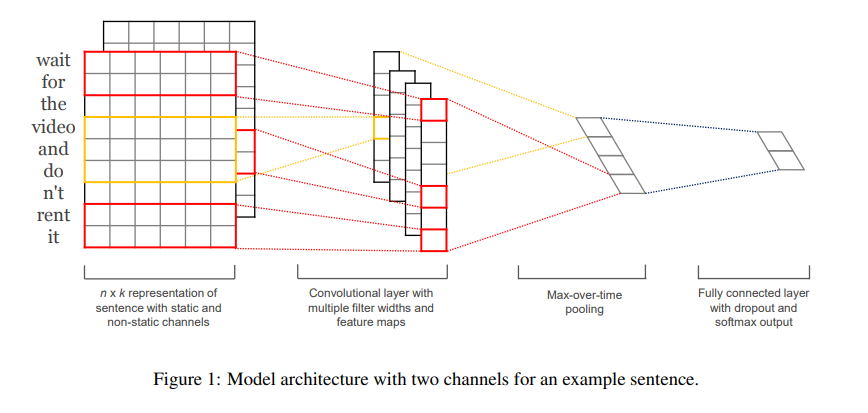

# easiest_nlp
### [NLP建模pipline](https://github.com/chenzhongd/easiest_nlp/blob/main/nlp_pipeline.ipynb)，可用于科研实验、企业建模
#### 功能包括：
- 1.数据预处理
- 2.数据集构建
- 3.预训练词向量应用（重点）
- 4.模型训练、评估、预测（重点）
- 5.模型线上化，保存java可调用pt模型文件（重点）
- 6.精细化模型评估（重点）

详见：[nlp_pipeline.ipynb](nlp_pipeline.ipynb)

### 预训练词向量

本项目中采用中文维基百科：下载链接 https://pan.baidu.com/s/1ZBVVD4mUSUuXOxlZ3V71ZA

下载完成后需要解压，放到[Word2vec文件夹](Word2vec)

更多中文词向量：https://github.com/chenzhongd/Chinese-Word-Vectors

### 数据集

来源于外卖评价，label为标签，二分类，其中0为负面评价，1为正面评价

[train.txt](dataset/train.txt)为训练集，[text.txt](dataset/test.txt)为测试集（测试集不能参与训练，仅能用于评估）


### 模型

TextCNN   属于轻量级的模型

Paper：[Convolutional Neural Networks for Sentence Classification](https://link.zhihu.com/?target=https%3A//aclanthology.org/D14-1181.pdf)

模型结构：



```python
TextCNN(
  (W): Embedding(2270, 300)
  (Weight): Linear(in_features=300, out_features=2, bias=False)
  (filter_list): ModuleList(
    (0): Conv2d(1, 100, kernel_size=(3, 300), stride=(1, 1))
    (1): Conv2d(1, 100, kernel_size=(4, 300), stride=(1, 1))
    (2): Conv2d(1, 100, kernel_size=(5, 300), stride=(1, 1))
  )
  (dropout): Dropout(p=0.3, inplace=False)
)
```

### 参考
https://github.com/graykode/nlp-tutorial/blob/master/2-1.TextCNN/TextCNN.ipynb